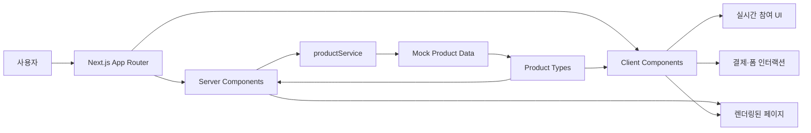

# DropDeal

> **모이면 가격이 내려갑니다.**
>
> 참여자가 늘어날수록 모두의 구매 가격이 낮아지는 실시간 공동구매 플랫폼

[](https://nextjs.org/)
[](https://react.dev/)
[](https://www.typescriptlang.org/)
[](https://tailwindcss.com/)

## 앱 소개

**DropDeal**은 공동구매 참여자가 일정 인원에 도달할 때마다 상품 가격이 단계적으로 내려가는 커머스 서비스입니다.

구매자는 현재 가격으로 먼저 공동구매에 참여하고, 종료 시점의 최종 가격이 더 낮아지면 차액을 자동으로 환불받습니다. 판매자는 가격 하락 규칙과 목표 인원을 직접 설정하고, 참여 현황과 재고를 한눈에 관리할 수 있습니다.

또한 판매 기한이 얼마 남지 않았거나 재고 소진이 필요한 상품을 위한 **재고털이 공동구매**와 쿠폰 이벤트를 제공하여 구매자와 판매자 모두에게 더 나은 거래 경험을 제공합니다.

## 핵심 가치

| 구매자 | 판매자 |
| --- | --- |
| 참여자가 모일수록 낮아지는 가격 | 공동구매를 통한 빠른 판매 촉진 |
| 먼저 참여해도 최종 가격 차액 자동 환불 | 참여 인원별 가격 정책 설정 |
| 실시간 참여 현황과 다음 가격 확인 | 상품 상태, 가격, 재고 통합 관리 |
| 재고털이 특가와 쿠폰 혜택 | 남은 재고의 효율적인 소진 |

## 페이지 소개

| 경로 | 페이지 | 주요 내용 |
| --- | --- | --- |
| `/` | 홈 | 진행 중인 공동구매, 재고털이 상품, 서비스 이용 방법 소개 |
| `/products` | 상품 목록 | 전체 공동구매 상품 탐색 및 재고털이 상품 필터링 |
| `/products/[id]` | 상품 상세 | 실시간 가격·참여 현황, 가격 하락 단계, 반응, Q&A, 후기 확인 |
| `/products/[id]/checkout` | 공동구매 참여 | 주문 상품과 결제 금액 확인, 결제 수단 선택 |
| `/payment/success` | 결제 성공 | 주문 번호와 결제 결과 확인 |
| `/payment/fail` | 결제 실패 | 결제 재시도 또는 상품 상세 이동 |
| `/mypage/orders` | 나의 참여 내역 | 공동구매 진행 상태, 최종 가격, 환불 금액 확인 |
| `/mypage/coupons` | 나의 쿠폰 | 보유 쿠폰의 할인율, 상태, 사용 기한 확인 |
| `/seller/products` | 판매자 상품 관리 | 등록 상품의 상태, 참여 인원, 현재 가격, 재고 관리 |
| `/seller/products/new` | 공동구매 등록 | 상품 정보와 가격 하락 정책 입력 및 단계별 가격 미리보기 |

## 기능 소개

### 실시간 공동구매

- 참여자가 설정된 단계에 도달하면 상품 가격이 자동으로 하락합니다.
- 현재 참여 인원, 남은 재고, 다음 가격까지 필요한 인원을 실시간으로 보여줍니다.
- 상품 상세 페이지의 LIVE 피드에서 신규 참여와 가격 변화를 확인할 수 있습니다.

### 가격 하락 및 차액 환불

- 구매자는 현재 가격으로 공동구매에 참여합니다.
- 공동구매 종료 후 최종 가격이 더 낮으면 결제 차액을 자동 환불받습니다.
- 최소 참여 인원을 달성하지 못한 경우 결제 금액 전액 환불을 안내합니다.

### 재고털이 및 쿠폰

- 재고 소진이 필요한 상품만 모아 탐색할 수 있습니다.
- 일부 재고털이 공동구매에는 추첨형 할인 쿠폰 이벤트가 제공됩니다.
- 마이페이지에서 쿠폰 상태와 사용 기한을 확인할 수 있습니다.

### 참여형 상품 상세

- 상품별 현재 할인율과 최저 판매가를 비교할 수 있습니다.
- 공동구매 반응을 남기고 실시간 피드에서 확인할 수 있습니다.
- 판매자 Q&A와 구매 후기를 한 화면에서 제공합니다.

### 판매자 센터

- 판매 상품의 공동구매 상태, 참여 인원, 현재 가격, 재고를 관리합니다.
- 시작가, 최저가, 단계별 필요 인원과 할인 금액을 설정합니다.
- 입력한 정책을 바탕으로 참여 인원별 예상 가격을 즉시 미리 봅니다.

## 아키텍처



현재 프론트엔드는 `productService`가 비동기 API 호출을 모사하고, `src/mocks/products.ts`의 Mock 데이터를 반환하는 구조입니다. 실제 백엔드 연동 시 서비스 계층의 구현을 API 요청으로 교체할 수 있습니다.

### 디렉터리 구조

```text
src/
├─ app/                    # App Router 기반 페이지와 전역 스타일
│  ├─ products/            # 상품 목록, 상세, 결제
│  ├─ payment/             # 결제 성공·실패
│  ├─ mypage/              # 주문 내역, 쿠폰
│  └─ seller/              # 판매자 상품 관리·등록
├─ components/             # 공통 UI 및 상품 실시간 상세 컴포넌트
├─ services/               # 데이터 접근 서비스 계층
├─ mocks/                  # 개발용 Mock 상품 데이터
├─ types/                  # 공통 TypeScript 타입
└─ utils/                  # 가격 표시 및 계산 유틸리티
```

### 렌더링 구조

- **Server Components**: 홈, 상품 목록, 상품 상세 진입 시 상품 데이터를 조회하고 초기 화면을 렌더링합니다.
- **Client Components**: 실시간 참여 시뮬레이션, 반응 선택, 결제 처리, 판매 상품 등록 미리보기 등 사용자 인터랙션을 담당합니다.
- **Service Layer**: 페이지가 데이터 저장 방식에 직접 의존하지 않도록 상품 조회 로직을 분리합니다.

## 기술 스택

| 분류 | 기술 |
| --- | --- |
| Framework | Next.js 16 App Router |
| UI | React 19, CSS, Tailwind CSS 4 |
| Language | TypeScript |
| Data | Mock Data, Service Layer |
| Code Quality | ESLint |
| Deployment | Vercel |

## 시작하기

### 요구 사항

- Node.js 20 이상
- npm

### 설치 및 실행

```bash
npm install
npm run dev
```

브라우저에서 [http://localhost:3000](http://localhost:3000)에 접속합니다.

### 주요 명령어

```bash
npm run dev     # 개발 서버 실행
npm run build   # 프로덕션 빌드
npm run start   # 프로덕션 서버 실행
npm run lint    # ESLint 검사
```

## Vercel 배포

이 프로젝트는 Next.js 기반이므로 Vercel 프로젝트 생성 시 **Framework Preset을 `Next.js`로 선택**합니다.

1. GitHub 저장소를 Vercel에 연결합니다.
2. Framework Preset이 `Next.js`인지 확인합니다.
3. Build Command와 Output Directory는 기본값을 사용합니다.
4. 배포를 실행합니다.

---

© 2026 DropDeal. Created by [Leeka99](https://github.com/Leeka99).
