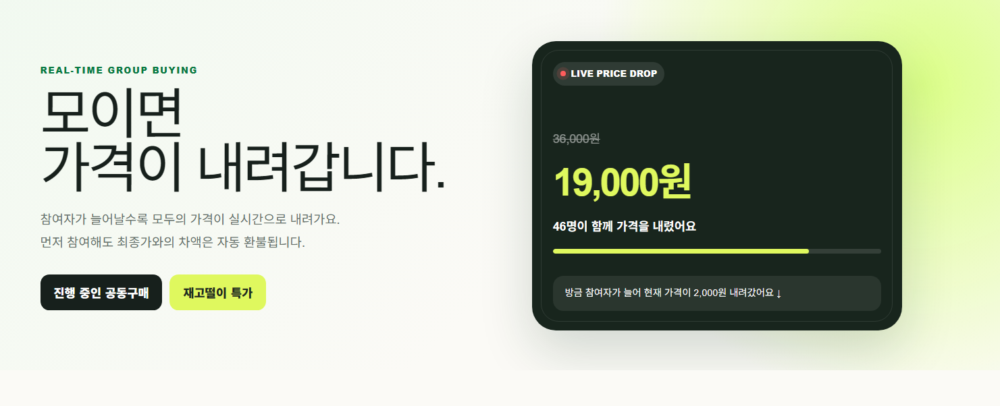
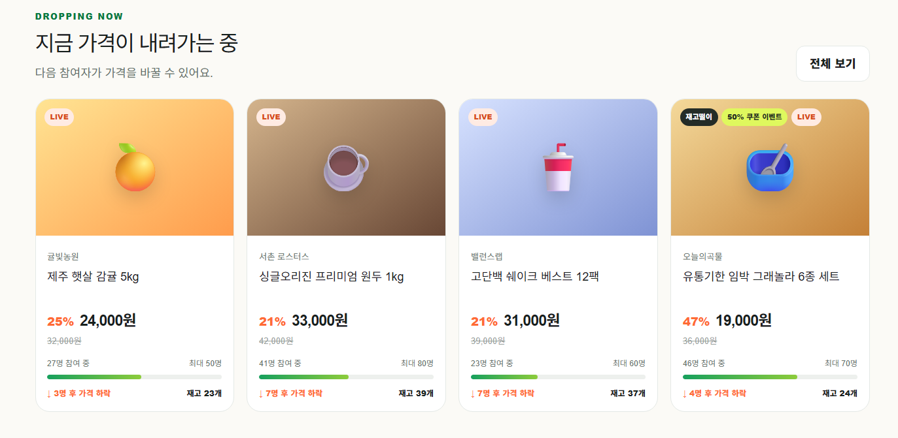
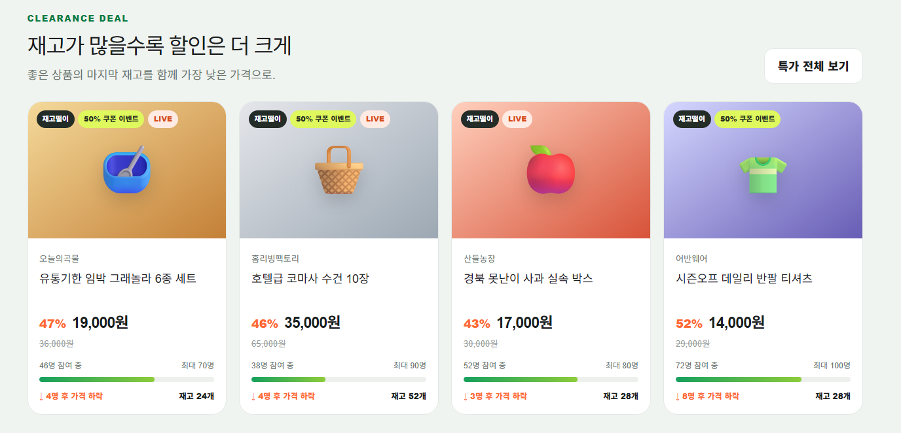
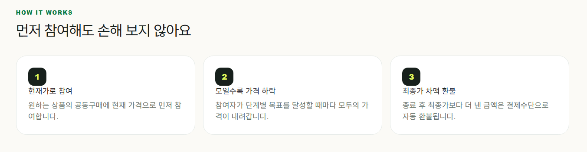
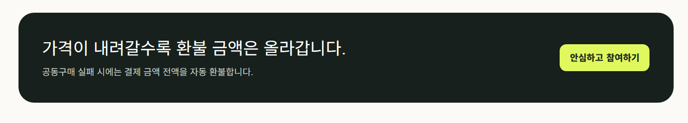
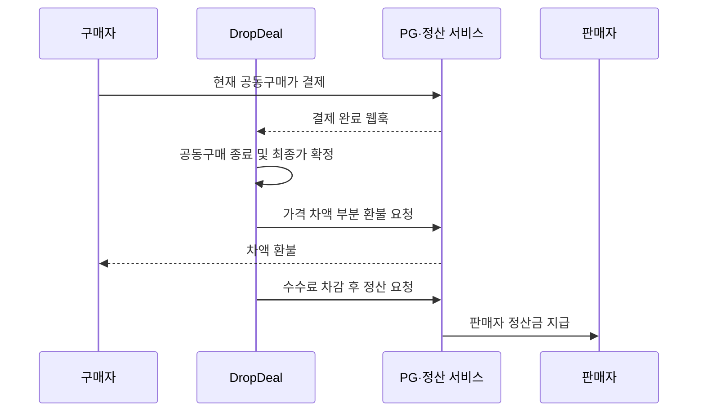
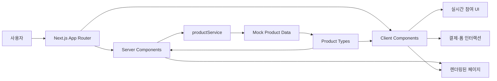
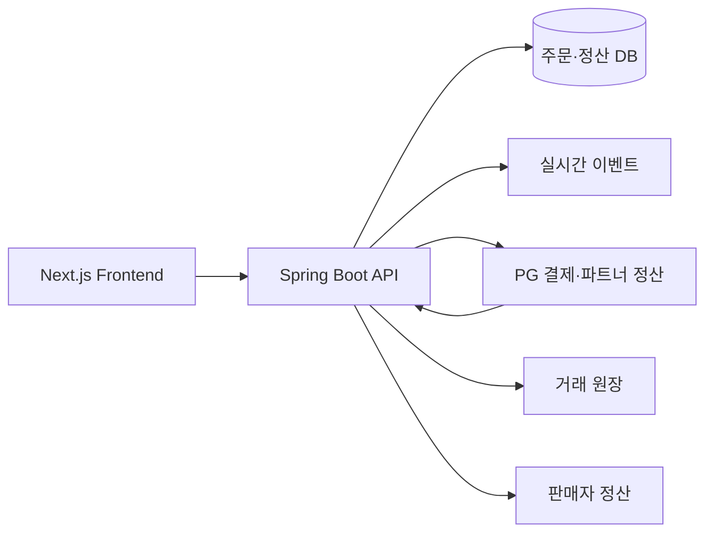

# DropDeal

> **모이면 가격이 내려갑니다.**
>
> 참여자가 늘어날수록 모두의 구매 가격이 낮아지는 실시간 공동구매 플랫폼

[](https://nextjs.org/)
[](https://react.dev/)
[](https://www.typescriptlang.org/)
[](https://tailwindcss.com/)

**공식 서비스:** [dropdealkr.com](https://dropdealkr.com)

## 브랜드 로고

| 쇼핑·가격 하락 로고 | 공동구매·배송 로고 |
| --- | --- |
|  |  |

DropDeal의 캐릭터는 쇼핑 카트와 아래 방향 화살표로 **함께 구매할수록 가격이 내려가는 서비스**를 표현합니다. 공동구매 참여자가 늘어나고 상품이 배송되는 전체 경험을 친근한 브랜드 이미지로 전달합니다.

## 앱 소개

**DropDeal**은 공동구매 참여자가 일정 인원에 도달할 때마다 상품 가격이 단계적으로 내려가는 커머스 서비스입니다.

구매자는 현재 가격으로 먼저 공동구매에 참여하고, 종료 시점의 최종 가격이 더 낮아지면 차액을 자동으로 환불받습니다. 판매자는 정가와 총 재고를 입력하고, 시스템이 산정한 가격 하락 규칙과 목표 인원을 바탕으로 참여 현황을 관리할 수 있습니다.

또한 판매 기한이 얼마 남지 않았거나 재고 소진이 필요한 상품을 위한 **재고털이 공동구매**와 쿠폰 이벤트를 제공하여 구매자와 판매자 모두에게 더 나은 거래 경험을 제공합니다.

### 설치형 웹앱

DropDeal은 모바일과 데스크톱에서 홈 화면에 설치할 수 있는 PWA를 지원합니다.

- 브라우저에서 앱으로 설치 후 standalone 화면으로 실행
- DropDeal 캐릭터 앱 아이콘과 브랜드 테마 색상 적용
- 공동구매 상품과 내 참여 내역 바로가기 제공
- 네트워크 연결이 끊긴 경우 전용 오프라인 안내 화면 제공

## 서비스 화면

### 모이면 가격이 내려가는 실시간 공동구매



DropDeal의 핵심 가치와 현재 진행 중인 가격 하락을 한눈에 보여주는 메인 화면입니다. 참여자가 늘어날수록 가격이 내려가며, 먼저 참여한 구매자도 종료 후 최종가와의 차액을 환불받는다는 서비스 구조를 소개합니다.

### 지금 가격이 내려가는 상품



현재 진행 중인 공동구매 상품의 가격과 참여 현황을 비교할 수 있습니다. 상품 카드에서 현재 할인율, 현재가, 참여 인원, 다음 가격 하락까지 필요한 인원을 확인할 수 있습니다.

### 재고가 많을수록 커지는 할인



재고 소진이 필요한 상품을 더 큰 할인율로 제공하는 재고떨이 특가 영역입니다. 재고떨이 여부, 실시간 진행 상태, 시스템 추천 쿠폰 이벤트 대상 상품을 배지로 구분합니다.

### 먼저 참여해도 손해 보지 않는 구매 방식



구매자는 현재 가격으로 먼저 참여하고, 참여자가 단계별 목표를 달성할 때마다 모든 구매자의 최종 가격이 내려갑니다. 공동구매 종료 후 먼저 결제한 금액과 최종가의 차액은 자동 환불됩니다.

### 안심할 수 있는 환불 정책



가격이 내려갈수록 구매자의 환불 예정 금액은 커집니다. 공동구매가 최소 참여 인원을 달성하지 못하면 결제 금액 전액을 자동 환불하여 구매 위험을 줄입니다.

## 핵심 가치

| 구매자 | 판매자 |
| --- | --- |
| 참여자가 모일수록 낮아지는 가격 | 공동구매를 통한 빠른 판매 촉진 |
| 먼저 참여해도 최종 가격 차액 자동 환불 | 재고와 상품 유형 기반 자동 가격 정책 |
| 실시간 참여 현황과 다음 가격 확인 | 상품 상태, 가격, 재고 통합 관리 |
| 재고털이 특가와 쿠폰 혜택 | 남은 재고의 효율적인 소진 |

## 페이지 소개

| 경로 | 페이지 | 주요 내용 |
| --- | --- | --- |
| `/` | 홈 | 진행 중인 공동구매, 재고털이 상품, 서비스 이용 방법 소개 |
| `/products` | 상품 목록 | 전체 공동구매 상품 탐색 및 재고털이 상품 필터링 |
| `/products/[id]` | 상품 상세 | 실시간 가격·참여 현황, 가격 하락 단계, 반응, Q&A, 후기 확인 |
| `/products/[id]/checkout` | 공동구매 참여 | 주문 상품과 결제 금액 확인, 결제 수단 선택 |
| `/payment/success` | 결제 성공 | 주문 번호와 결제 결과 확인 |
| `/payment/fail` | 결제 실패 | 결제 재시도 또는 상품 상세 이동 |
| `/mypage/orders` | 나의 참여 내역 | 공동구매 진행 상태, 최종 가격, 환불 금액 확인 |
| `/mypage/coupons` | 나의 쿠폰 | 보유 쿠폰의 할인율, 상태, 사용 기한 확인 |
| `/seller/products` | 판매자 상품 관리 | 등록 상품의 상태, 참여 인원, 현재 가격, 재고 관리 |
| `/seller/products/new` | 공동구매 등록 | 상품 정보와 가격 하락 정책 입력 및 단계별 가격 미리보기 |
| `/login` | 로그인 | 구매자·승인 판매자 계정 로그인 및 역할별 접근 제어 |

### 도입 예정 페이지

| 경로 | 페이지 | 주요 내용 |
| --- | --- | --- |
| `/seller/settlements` | 판매자 정산 내역 | 기간별 매출, 수수료, 환불액, 정산 예정금 확인 |
| `/seller/settlements/[id]` | 판매자 정산 상세 | 주문별 수수료 계산과 지급 상태 확인 |
| `/admin/revenue` | 플랫폼 수익 대시보드 | 총 거래액, 플랫폼 수익, 환불 및 정산 현황 확인 |
| `/admin/settlements` | 관리자 정산 관리 | 판매자 정산 승인, 보류, 실패 건 재처리 |
| `/admin/commission-policies` | 수수료 정책 관리 | 판매금액별 중개수수료 구간과 변경 이력 관리 |

## 기능 소개

### 실시간 공동구매

- 참여자가 설정된 단계에 도달하면 상품 가격이 자동으로 하락합니다.
- 현재 참여 인원과 다음 가격까지 필요한 인원을 실시간으로 보여줍니다.
- 상품 상세 페이지의 LIVE 피드에서 신규 참여와 가격 변화를 확인할 수 있습니다.

### 가격 하락 및 차액 환불

- 구매자는 현재 가격으로 공동구매에 참여합니다.
- 공동구매 종료 후 최종 가격이 더 낮으면 결제 차액을 자동 환불받습니다.
- 최소 참여 인원을 달성하지 못한 경우 결제 금액 전액 환불을 안내합니다.

### 재고털이 및 쿠폰

- 재고 소진이 필요한 상품만 모아 탐색할 수 있습니다.
- 쿠폰은 3%, 5%, 10%, 15%, 30% 다섯 종류로 운영합니다.
- 상품 유형과 예상 참여율에 따라 시스템이 적합한 쿠폰을 추천합니다.
- 최대 할인 도달 상품은 쿠폰 중복 할인을 제한하고, 30% 쿠폰은 특별 프로모션 승인 후 한정 적용합니다.
- 마이페이지에서 쿠폰 상태와 사용 기한을 확인할 수 있습니다.

| 쿠폰 | 자동 적용 대상 | 할인 제한 |
| --- | --- | --- |
| 3% | 전체 공동구매의 신규 참여 유도 | 최대 3,000원 |
| 5% | 참여율 70% 이상 상품, 재구매 유도 | 최대 5,000원 |
| 10% | 참여율 40~70% 또는 마감 임박 상품 | 최대 10,000원 |
| 15% | 참여율 40% 미만 또는 재고떨이 상품 | 최대 15,000원 |
| 30% | 승인된 특별 프로모션 상품 | 최대 10,000원, 최종 참여 인원의 5% 추첨 |

30% 쿠폰 지급 수량은 `max(1명, floor(최종 참여 인원 × 5%))`로 계산합니다. 공동구매가 성공한 경우에만 참여자 중 무작위로 추첨하며, 상품별 1인 1회 지급합니다.

### 참여형 상품 상세

- 상품별 현재 할인율과 최저 판매가를 비교할 수 있습니다.
- 공동구매 반응을 남기고 실시간 피드에서 확인할 수 있습니다.
- 판매자 Q&A와 구매 후기를 한 화면에서 제공합니다.

### 판매자 센터

- 로그인한 사용자 중 승인된 판매자 역할만 판매자센터에 접근할 수 있습니다.
- 판매자 경로는 Proxy와 서버 역할 검사로 보호하며, 구매자 계정은 접근할 수 없습니다.
- 판매 상품의 공동구매 상태, 참여 인원, 현재 가격, 재고를 관리합니다.
- 정가와 총 재고를 입력하면 시작가, 최저가, 단계별 필요 인원과 할인 금액을 자동 산정합니다.
- 일반 공동구매와 재고떨이 상품의 등록 기준을 확인하고 상품 유형을 선택합니다.
- 재고떨이 상품은 소진 사유와 상품 상태를 구매자에게 고지합니다.
- 입력한 정책을 바탕으로 참여 인원별 예상 가격을 즉시 미리 봅니다.

## 수익화 및 정산 설계

> 현재 수익화 기능은 기능 명세에 반영된 **도입 예정 설계**입니다. 실제 운영 전 PG·정산 서비스 연동과 법률 검토가 필요합니다.

DropDeal의 핵심 수익 모델은 공동구매 성공 시 판매자에게 부과하는 **거래 중개수수료**입니다. 구매자에게 별도 이용료를 부과하지 않으며, 수수료는 차액 환불이 완료된 `최종 판매금액`을 기준으로 계산합니다.

### 중개수수료 모델

플랫폼 중개수수료는 예상 최종 판매금액이 높을수록 낮아지는 구간제를 적용합니다. 판매자는 상품 등록 화면에서 수수료율을 직접 수정할 수 없으며, 시스템이 예상 판매 규모에 맞는 구간을 자동 적용합니다.

예상 최종 판매금액은 단순히 최저 판매가와 전체 재고를 곱하지 않습니다. 상품 유형별 예상 소진율, 정가대, 총 재고 규모, 최소 참여 인원과 예상 도달 가격 단계를 반영하여 **예상 참여 인원 × 예상 최종 단가**로 계산합니다.

| 예상 최종 판매금액 | 중개수수료율 |
| --- | --- |
| 100만원 미만 | 12% |
| 100만원 이상 | 10% |
| 300만원 이상 | 8% |
| 1,000만원 이상 | 6% |

가격 하락 단계도 총 재고에 따라 자동 설정합니다. 재고가 많을수록 더 많은 가격 단계를 제공하며, 상품 유형과 정가를 기준으로 공동구매 시작가·최저 판매가·단계당 할인 금액을 계산합니다.

최소 참여 인원도 판매자가 직접 지정하지 않습니다. 총 재고가 적은 상품은 높은 성립 비율을, 대량 상품은 낮은 성립 비율을 적용하며 재고떨이 상품은 일반 공동구매보다 기준을 낮춥니다.

가격 할인은 시스템이 산정한 최소 참여 인원을 달성한 시점부터 시작합니다. 최소 참여 인원 달성 전에는 정가를 유지하고, 달성 시 공동구매 시작가를 적용한 뒤 남은 참여 가능 인원을 가격 단계별로 나눠 최저 판매가까지 할인합니다.

공동구매 상품은 최소 **총 재고 10개**부터 등록할 수 있습니다. 정가와 총 재고 입력은 수정 중 빈 값을 허용하며, 입력을 마치면 시스템이 최소 허용값으로 검증·보정합니다.

| 총 재고 수량 | 가격 하락 단계 |
| --- | --- |
| 30개 이하 | 3단계 |
| 31~60개 | 5단계 |
| 61~100개 | 7단계 |
| 101~200개 | 9단계 |
| 201개 이상 | 12단계 |

### 상품 유형 등록 기준

| 상품 유형 | 등록 기준 |
| --- | --- |
| 일반 공동구매 | 별도 상태 고지가 필요하지 않은 정상 상품, 안정적인 재고와 배송 일정 확보 |
| 재고떨이 상품 | 과잉 재고, 시즌오프, 유통기한 임박, 외관상 하자 등 명확한 소진 사유 존재 |

재고떨이 상품은 등록 시 소진 사유와 상품 상태를 구매자에게 반드시 고지해야 합니다.

```text
플랫폼 수익 = 최종 판매금액 × 중개수수료율

판매자 정산금 =
최종 판매금액
- 플랫폼 중개수수료
- PG 수수료
- 판매자 부담 할인금
- 추가 비용
```

공동구매 실패 또는 주문 전액 취소 시에는 중개수수료를 부과하지 않습니다.

### 결제·환불·정산 흐름



판매자 정산은 공동구매 종료 직후가 아니라 차액 환불, 배송, 반품 가능 기간 종료 후 진행합니다. 플랫폼이 판매대금을 직접 보관하지 않고 PG사의 파트너 정산 또는 지급대행 서비스를 이용하는 구조를 우선합니다.

### 정산 원칙

- 결제, 환불, 수수료, 정산 금액은 백엔드에서 다시 계산합니다.
- 주문 생성 시 적용된 수수료율을 저장하여 이후 정책 변경의 영향을 받지 않게 합니다.
- 결제 승인, 부분 환불, 정산 요청에는 멱등키를 사용해 중복 처리를 방지합니다.
- 모든 거래는 결제·환불·수수료·정산 원장에 기록합니다.
- 배송 지연, 환불 처리, 분쟁, 계좌 검증 실패 시 정산을 보류합니다.

### 추가 수익 모델

거래량과 판매자 수가 확보되면 판매자 구독제, 상품 상단 노출 광고, 쿠폰 비용 분담, 제휴 물류 수수료, 공동구매 성공 보너스 수수료를 단계적으로 도입할 수 있습니다.

## 아키텍처



현재 프론트엔드는 `productService`가 비동기 API 호출을 모사하고, `src/mocks/products.ts`의 Mock 데이터를 반환하는 구조입니다. 실제 백엔드 연동 시 서비스 계층의 구현을 API 요청으로 교체할 수 있습니다.

### 운영 아키텍처 확장 계획



향후 Spring Boot 백엔드에서 주문, 최종 가격 확정, 차액 환불, 중개수수료 계산, 판매자 정산을 처리합니다. 결제와 정산의 근거가 되는 거래 원장은 기존 기록을 직접 수정하지 않고 반대 거래를 추가하는 방식으로 관리합니다.

### 디렉터리 구조

```text
src/
├─ app/                    # App Router 기반 페이지와 전역 스타일
│  ├─ products/            # 상품 목록, 상세, 결제
│  ├─ payment/             # 결제 성공·실패
│  ├─ mypage/              # 주문 내역, 쿠폰
│  └─ seller/              # 판매자 상품 관리·등록
├─ components/             # 공통 UI 및 상품 실시간 상세 컴포넌트
├─ services/               # 데이터 접근 서비스 계층
├─ mocks/                  # 개발용 Mock 상품 데이터
├─ types/                  # 공통 TypeScript 타입
└─ utils/                  # 가격 표시 및 계산 유틸리티
```

### 렌더링 구조

- **Server Components**: 홈, 상품 목록, 상품 상세 진입 시 상품 데이터를 조회하고 초기 화면을 렌더링합니다.
- **Client Components**: 실시간 참여 시뮬레이션, 반응 선택, 결제 처리, 판매 상품 등록 미리보기 등 사용자 인터랙션을 담당합니다.
- **Service Layer**: 페이지가 데이터 저장 방식에 직접 의존하지 않도록 상품 조회 로직을 분리합니다.

## 기술 스택

| 분류 | 기술 |
| --- | --- |
| Framework | Next.js 16 App Router |
| UI | React 19, CSS, Tailwind CSS 4 |
| Language | TypeScript |
| Data | Mock Data, Service Layer |
| Code Quality | ESLint |
| Deployment | Vercel |
| Domain | [dropdealkr.com](https://dropdealkr.com) |
| Planned Backend | Spring Boot, PG·파트너 정산 API |

---

© 2026 DropDeal. Created by [Leeka99](https://github.com/Leeka99).
